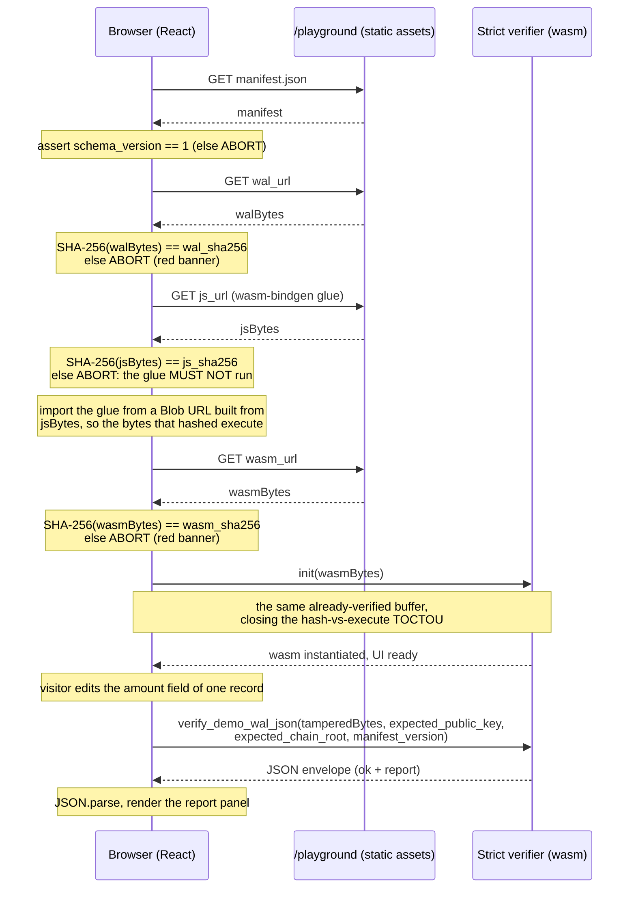

# Playground async init + integrity check flow

Sequence diagram for what happens between page load and the first
`verify_demo_wal_json` call. Read this alongside §1 and §2 of
[INTEGRATION.md](INTEGRATION.md).

## Failure modes and what the UI shows

| Stage | What can go wrong | UI response |
|---|---|---|
| Manifest fetch | 404, 500, network error | Red banner: "Could not load manifest. Try again or report at /security." |
| `schema_version` mismatch | Manifest schema bumped, this build does not understand it | Red banner: "Playground build is out of date. Refresh; if this persists, report at /security." |
| WAL hash mismatch | CDN serves a different `demo.jsonl` than the manifest pinned | Red banner: "Manifest verification failed: WAL hash mismatch. Refusing to verify." Do NOT fall back to running the verifier. That would be lying to the visitor. |
| **JS glue hash mismatch** | CDN serves a different `spine_wasm.js` than the manifest pinned | Red banner: "Manifest verification failed: JS glue hash mismatch. Refusing to verify." **Do NOT import the bytes**: a static `import` of a malicious glue would run attacker code before any check. The integration uses fetch + Blob URL + dynamic import precisely so the failure path can refuse to execute the glue. |
| WASM hash mismatch | Same, for the wasm bundle | Red banner: "Manifest verification failed: WASM hash mismatch. Refusing to verify." |
| `init()` rejection | Bundle does not load (corrupt, wrong target, etc.) | Red banner: "Verifier failed to initialise. Report at /security." |
| `verify_demo_wal_json` returns `ok:true` with `report.status === "error"` | Caller-side configuration error (malformed `expected_pubkey` or `expected_root`, in practice unreachable when the manifest hash check has already passed) | Render `report.error` as a banner. This is a "your bootstrap is broken" message, not a tampering signal. |
| `verify_demo_wal_json` returns `ok:true` with `report.status === "invalid"` | The actual demo: tampering detected, or in pathological cases an `error`-shaped record outcome on the last record in `report.records` | Render the side-by-side diff panel. This is the **good** failure path: it is the demo's pitch. |
| `verify_demo_wal_json` returns `ok:false` | Internal serialization bug in `spine-core` (effectively unreachable) | Render `error.kind` as a fallback banner and link to /security so the deploy team learns about it. |

## Why the strict order matters

Each fetch-and-hash step is sequential and depends on the one before it.
The final `init()` call **must** receive the same `wasmBytes` whose hash
was just verified, not a fresh fetch. If the page issued a separate
`init('/playground/...')` URL, the browser would do a second GET, and a
TOCTOU window would open between "we hashed the bytes" and "we executed
them." The wasm-bindgen generated `init()` accepts a `BufferSource` for
exactly this reason. Use it.

The strict order is also why all four resources (manifest, WAL, wasm,
the JS glue) live under a single origin, so every fetch is governed by
the same CSP, no cross-origin surprises.

## What this flow does NOT defend against

- A compromised CA chain or a malicious browser extension. The
  manifest pinning + browser-side hash check catches a CDN that serves
  inconsistent bytes; it does not defeat an attacker who controls the
  TLS or the browser process itself. Those are out of scope.
- A long-lived cached wasm bundle on the visitor's disk that pre-dates
  a manifest change. Because asset URLs include the content hash
  (a build-pipeline convention), the visitor's stale cache will simply 404 on
  the new URL, forcing a refetch. The host page is responsible for
  serving the up-to-date `index.html` with the new asset URL.
